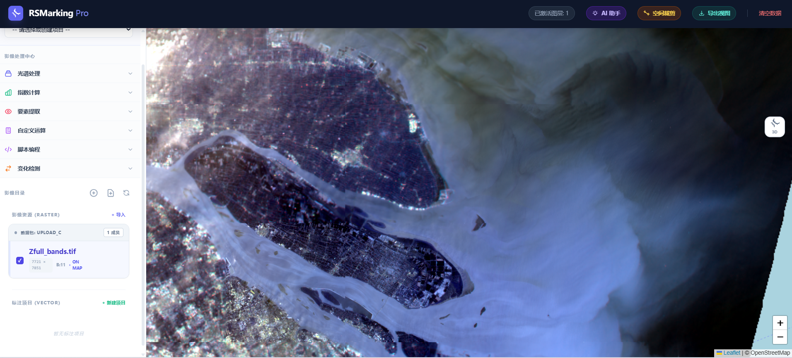
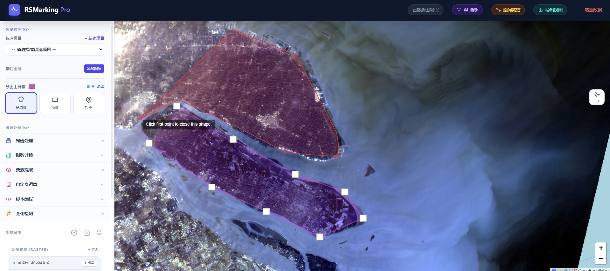
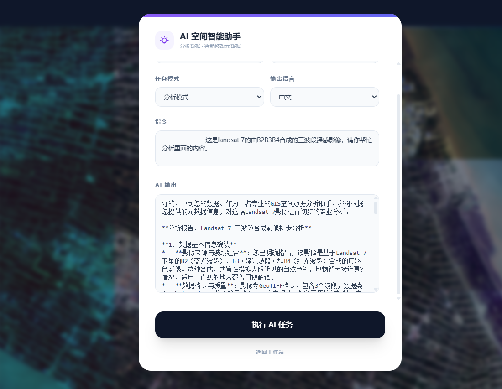
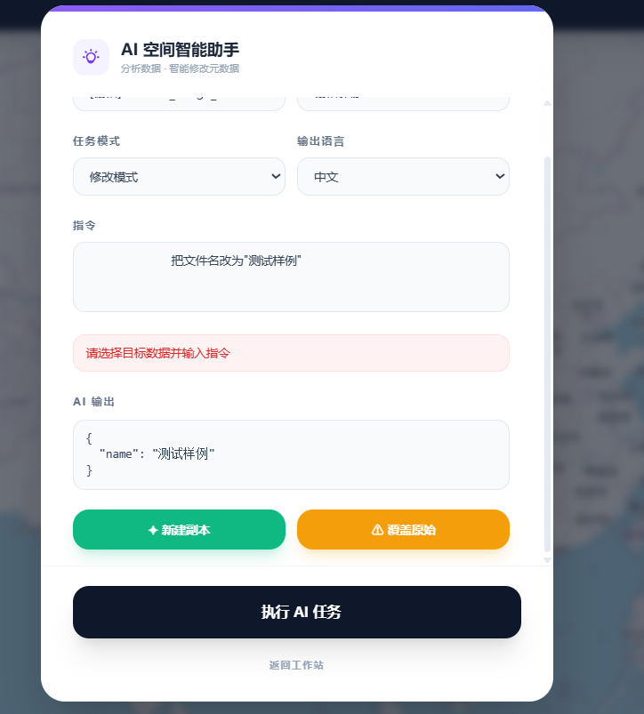
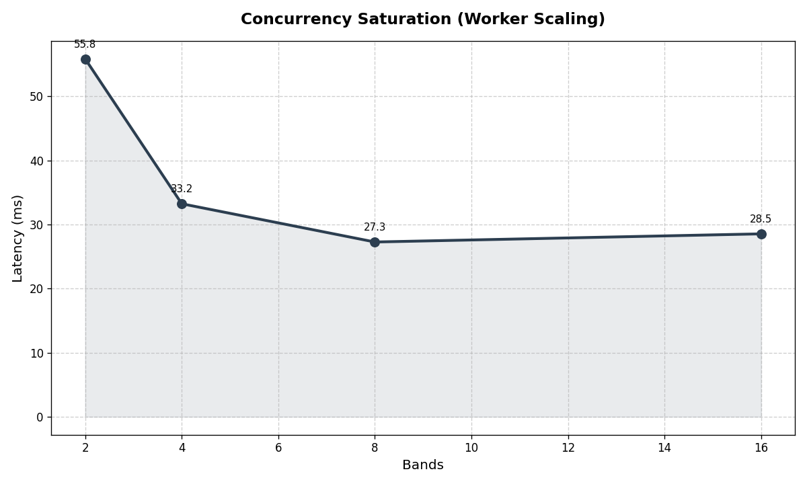
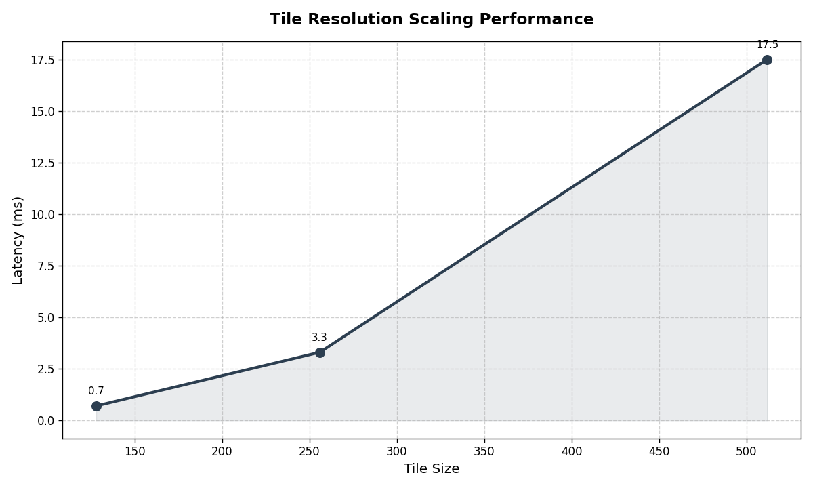

# Agent RSMarking: High-Performance Remote Sensing Annotation System

智能遥感影像高性能标注系统

[English](#english-documentation) | [中文](#中文文档)

---

[Agent](#71-overview--概述)

##  English Documentation

### 1. Introduction

**RSMarking** is a microservice-based Remote Sensing (RS) image annotation platform.  
It is designed to handle massive raster datasets (GeoTIFF) and complex vector geometries without the need for heavy pre-processing.

---

### 2. Core Advantages vs Traditional GIS

Compared to traditional GIS servers (e.g., GeoServer, MapServer) or standard web-mapping tools, RSMarking offers:

- **Cython-Accelerated On-the-Fly (OTF) Rendering**

  The built-in **TileEngine** uses C/Cython extensions (`fast_stretch_and_stack`) and `rasterio` window reads to dynamically generate map tiles directly from raw raster files.  
  **Zero pre-tiling required**, saving massive disk space and preprocessing time.

- **Dynamic Multi-Band Stretching**

  Automatically calculates statistics to perform **2%–98% linear stretching** or hardware-accelerated normalization, ensuring optimal visualization for **16-bit/32-bit multi-spectral imagery**.

- **Distributed Microservices Architecture**

  Decoupled **Tile Service** and **Annotation Service** with robust **FastAPI** backends, easily scalable via **Kubernetes**.

- **AI-Powered Spatial Data Gateway** *(Updated: March 16, 2026)*

  An integrated **AI Gateway** service that accepts natural language instructions to analyze or modify raster/vector GIS data.  
  Powered by a pluggable LLM backend (via **LiteLLM**), with a strict **Pydantic contract layer** to prevent AI from tampering with read-only spatial statistics.

  > **Competitive Landscape:**
  > - **QGIS** (including the latest 4.0 release on March 06, 2026) does **not** include a built-in AI Agent, making RSMarking a more forward-looking choice for AI-assisted geospatial workflows.
  > - **ArcGIS Pro** with *ArcGIS Assistant (Beta) 3.6* offers geospatial analysis capabilities that may exceed RSMarking in certain analytical depth — however, it remains a **commercial, paid product**, whereas RSMarking is **open and free**.
  > - RSMarking's AI Gateway is purpose-built for **remote sensing annotation workflows**, offering native raster/vector context injection, multi-language support, and a strict anti-tamper contract layer — features not available in general-purpose GIS AI assistants.

---

### 3. Development Setup (Current Dev Stage)

#### Prerequisites

- Docker & Docker Compose
- Python 3.12+
- Node.js 24+

---

#### Step 1: Start Infrastructure & Databases

```bash
cd infrastructure/docker
docker-compose up -d
```

---

#### Step 2: Run Database Migrations

```bash
# Migrate Raster Database
cd infrastructure/db_migrations
alembic upgrade head

# Migrate Vector Annotation Database
cd ../annot_migrations
alembic upgrade head
```

---

#### Step 3: Start Backend Services

```bash
conda env create -f environment.yml
conda activate your env

cd services/tile_service
python main.py

cd services/data_service  # main app
python main.py

cd services/annotation_service
python main.py

cd services/ai_gateway     # AI Gateway Service (New)
python main.py
```

---

#### Step 4: Configure AI Gateway Environment

Create a `.env` file in the project root and set the following variables:

```env
AI_MODEL=deepseek/deepseek-chat   # LiteLLM-compatible model identifier
AI_NAME=deepseek/deepseek-chat    # Runtime model override (optional)
DEEPSEEK_API_KEY=sk-xxxxxxxxxxxx  # Your LLM provider API Key
```

> The AI Gateway uses [LiteLLM](https://github.com/BerriAI/litellm) as its unified LLM adapter,  
> supporting any compatible provider (DeepSeek, OpenAI, Azure, etc.) by simply changing `AI_MODEL`.

---

#### Step 5: Start Frontend

```bash
cd client
npm install
npm run dev
```

---

## 中文文档

### 1. 简介

**RSMarking** 是一个基于 **微服务架构** 的遥感影像标注平台。

系统专为处理 **海量栅格数据集（GeoTIFF）** 和 **复杂矢量几何数据** 而设计，无需繁重的预处理流程即可实现高性能的交互式标注。

---

### 2. 核心特性与优势（对比传统 GIS）

与传统的 GIS 服务器（如 **GeoServer**）或常规 **Web GIS** 平台相比，本项目具有以下显著优势：

- **Cython 加速的即时渲染 (On-the-Fly Rendering)**

  内置的 **TileEngine** 抛弃了传统的"提前切片生成金字塔"方案。  
  通过 `rasterio` 窗口读取结合 **C/Cython 底层扩展 (`fast_stretch_and_stack`)**，直接在内存中动态生成瓦片。  

  **零预处理开销，极大节省磁盘空间与数据准备时间。**

- **动态多波段拉伸算法**

  引擎内置状态管理器，自动计算极值并执行 **16位 / 32位影像** 的线性拉伸或归一化映射。  
  在遇到极值异常时提供高度优化的 **Fallback Process（降级处理策略）**。

- **分布式微服务架构**

  **瓦片服务 (Tile Service)** 与 **标注服务 (Annotation Service)** 完全解耦。  
  通过 **FastAPI** 提供高并发支持，并可通过 **Kubernetes** 实现无缝横向扩展。

- **AI 空间数据智能网关 (AI Gateway)** *(2026 年 3 月 16 日更新)*

  集成 **AI 网关微服务**，接受自然语言指令，对栅格或矢量 GIS 数据执行**智能分析**或**结构化修改**。  
  通过 **LiteLLM** 适配多种主流大语言模型，并采用严格的 **Pydantic 契约层**防止 AI 篡改只读空间统计数据。

  > **横向对比主流 GIS 软件：**
  > - **QGIS**（含 2026 年 3 月 6 日发布的 4.0 版本）**尚未内置 AI Agent 功能**，而 RSMarking 已于 2026 年 3 月 16 日正式集成，在 AI 辅助遥感工作流方面具备先发优势。
  > - **ArcGIS Pro** 的 *ArcGIS Assistant (Beta) 3.6* 在部分地理空间分析深度上优于本项目，但其属于**商业付费软件**；RSMarking 作为**开源免费**平台，在可访问性与部署灵活性上更具优势。
  > - RSMarking 的 AI 网关专为**遥感影像标注工作流**深度定制，原生支持栅格/矢量上下文注入、多语言响应及防篡改契约层，是通用 GIS AI 助手所不具备的核心能力。

---

### 3. 开发环境快速开始（当前开发阶段）

#### 预需求

- Docker & Docker Compose
- Python 3.12+
- Node.js 24+

---

#### 第一步：启动基础设施与数据库

使用 **IaC 配置** 启动数据库实例（PostgreSQL/PostGIS, Redis）。

```bash
cd infrastructure/docker
docker-compose up -d
```

---

#### 第二步：执行数据库迁移脚本

```bash
# 迁移栅格元数据数据库
cd infrastructure/db_migrations
alembic upgrade head

# 迁移矢量标注数据库
cd ../annot_migrations
alembic upgrade head
```

---

#### 第三步：启动后端服务

```bash
conda env create -f environment.yml
conda activate your env

cd services/tile_service
python main.py

cd services/data_service  # main app 
python main.py

cd services/annotation_service
python main.py

cd services/ai_gateway     # AI 网关服务（新增）
python main.py
```

---

#### 第四步：配置 AI 网关环境变量

在项目根目录创建 `.env` 文件，并配置以下参数：

```env
AI_MODEL=deepseek/deepseek-chat   # LiteLLM 兼容的模型标识符
AI_NAME=deepseek/deepseek-chat    # 运行时模型覆盖（可选）
DEEPSEEK_API_KEY=sk-xxxxxxxxxxxx  # 你的大模型服务商 API Key
```

> AI 网关通过 [LiteLLM](https://github.com/BerriAI/litellm) 统一适配多种大模型服务商。  
> 仅需修改 `AI_MODEL` 即可切换至 DeepSeek、OpenAI、Azure OpenAI 等任意兼容提供商。

---

#### 第五步：启动前端应用

```bash
cd client
npm install
npm run dev
```

---

## 4. Program Construction / 项目结构说明

Please check **Framework.txt**  
详情查看 **Framework.txt**

```text
.
├── client                # 前端交互与状态管理 (Vue/React + Leaflet)
├── services              # 后端微服务集群 (FastAPI)
│   ├── tile_service      # 瓦片渲染引擎 (Cython 加速)
│   ├── data_service      # 栅格元数据管理服务
│   ├── annotation_service# 矢量标注服务
│   └── ai_gateway        # AI 空间数据智能网关 (新增)
│       ├── main.py           # 服务启动入口
│       ├── router.py         # 路由层 (POST /ai/process)
│       ├── schema_validator.py # Pydantic 契约层 (防篡改校验)
│       └── translator.py     # 数据提取、Prompt 引擎与 LLM 调度
├── infrastructure        # 基础设施即代码 (IaC)
│   ├── docker            # 各模块 Dockerfile 及 Compose
│   ├── kubernetes        # K8s 部署配置文件
│   ├── annot_migrations  # 矢量数据迁移脚本
│   └── db_migrations     # 栅格元数据数据库迁移脚本
└── tests                 # 全局自动化测试 (Pytest & Vitest)
```

---

## 5. 🖼️ Feature Preview / 功能预览

### 5.1 Multi-spectral Image OTF Rendering / 多光谱影像即时渲染

Directly rendering **16-bit GeoTIFF** with dynamic stretching.  
直接渲染 **16位 GeoTIFF** 并应用动态拉伸。



---

### 5.2 Interactive Vector Annotation / 交互式矢量标注

Support for complex polygons with **undo/redo** and **topology constraints**.  
支持带 **撤销/重做功能** 及 **拓扑约束** 的复杂多边形标注。



---

### 5.3 Distributed Service Monitoring / 分布式服务监控

Real-time status of **tile service** and **annotation engine**.  
瓦片服务与标注引擎的实时运行状态。

---

### 5.4 AI Gateway — Natural Language GIS Processing / AI 网关 — 自然语言 GIS 处理

#### Analyze Mode / 分析模式

Submit a natural language query to receive a professional spatial data analysis report.  
提交自然语言问题，获取专业的空间数据分析报告。



---

#### Modify Mode / 修改模式

Issue a natural language instruction to modify GIS layer metadata; the AI returns a strictly validated JSON diff for frontend confirmation before committing.  
通过自然语言指令修改 GIS 图层元数据，AI 返回经严格校验的 JSON 差异供前端确认后落库。



---

### 5.5 Automated Test Suite / 自动化测试套件

High coverage reports from **Vitest** and **Pytest**.  
来自 **Vitest** 和 **Pytest** 的高覆盖率测试报告。

---

## 6. ⚙️ Performance Results / 性能结果

### 6.1 Rendering Engine Performance / 渲染引擎性能

#### 6.1.1 Concurrency Test / 高并发争抢测试



*Relationship between band and latency under high concurrency*

*高并发下波段与延迟的关系*

#### 6.1.2 Rendering Test / 渲染测试



*The trend of rendering latency increasing with tile size(3 bands, 128–4096 pixels)*

*渲染延迟随 tile 大小增加的趋势(3 波段，128–4096 像素)*


---
[Come Back to the Top](#agent-rsmarking-high-performance-remote-sensing-annotation-system)

## 7. 🤖 AI Gateway — Architecture Deep Dive / AI 网关架构详解

### 7.1 Overview / 概述

The **AI Gateway** (`services/ai_gateway`) is a dedicated microservice that bridges natural language instructions with structured GIS data operations.  
**AI 网关**（`services/ai_gateway`）是一个独立微服务，负责将自然语言指令桥接至结构化的 GIS 数据操作。

### 7.2 Request Flow / 请求流程

```
Frontend / 前端
    │
    │  POST /ai/process
    │  { target_id, data_type, mode, language, user_prompt, overwrite }
    ▼
router.py  ──►  translator.py
                    │
                    ├─ 1. Extract Context (DB → Pydantic ContextData)
                    │      ├── RasterContextData  (rasterio stats + metadata)
                    │      └── VectorContextData  (PostGIS ST_Extent + JSONB agg)
                    │
                    ├─ 2. Build Prompt  (_build_system_prompt)
                    │      ├── ANALYZE: free-form professional report
                    │      └── MODIFY:  strict JSON Schema constraint
                    │
                    ├─ 3. Call LLM  (LiteLLM acompletion + auto-retry)
                    │
                    └─ 4. Validate & Write
                           ├── ANALYZE → return plain text report
                           └── MODIFY  → schema_validator.py (Pydantic anti-tamper)
                                             ├── overwrite=true  → UPDATE DB
                                             └── overwrite=false → CREATE new record
```

### 7.3 Task Modes / 任务模式

| Mode / 模式 | Description / 说明 | Output / 输出 |
|---|---|---|
| `analyze` | Professional spatial data analysis report | Plain text / 纯文本报告 |
| `modify` | AI-driven metadata modification with anti-tamper validation | Validated JSON + DB write |

### 7.4 Anti-Tamper Contract Layer / 防篡改契约层

A core security design: the AI is **only permitted to output fields defined in `RasterModifiable` / `VectorModifiable`**.  
核心安全设计：AI **只允许输出 `RasterModifiable` / `VectorModifiable` 中定义的字段**。

All read-only spatial statistics (`bounds`, `stats`, `crs`, `resolution`, etc.) are **physically blocked** by Pydantic — even if the LLM attempts to overwrite them, the values are silently discarded.  
所有只读空间统计字段（`bounds`、`stats`、`crs`、`resolution` 等）均由 Pydantic **物理拦截** —— 即使大模型尝试篡改，这些值也会被静默丢弃。

### 7.5 Multi-language Support / 多语言支持

The AI response language is controlled by the `language` field in the request payload:  
AI 响应语言由请求体中的 `language` 字段控制：

| Value | Language |
|---|---|
| `zh` | 简体中文 (default) |
| `en` | English |
| `ja` | 日本語 |

### 7.6 API Reference / 接口说明

**`POST /ai/process`**

| Field | Type | Required | Description |
|---|---|---|---|
| `target_id` | `int` \| `str` | ✅ | Raster `index_id` or Vector Layer UUID |
| `data_type` | `raster` \| `vector` | ✅ | Data type |
| `mode` | `analyze` \| `modify` | ✅ | Task mode |
| `language` | `zh` \| `en` \| `ja` | — | Response language (default: `zh`) |
| `user_prompt` | `string` | ✅ | Natural language instruction (2–2000 chars) |
| `overwrite` | `bool` | — | Overwrite original record (default: `false`, creates new) |

