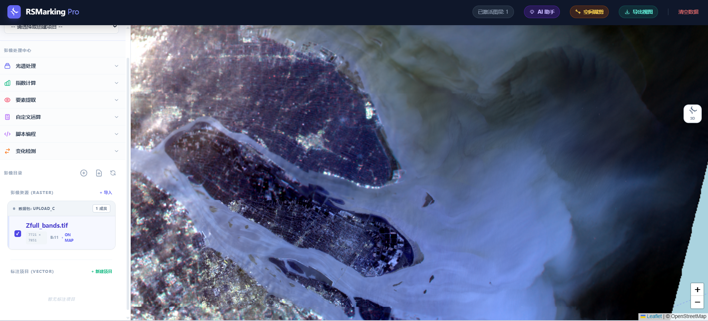
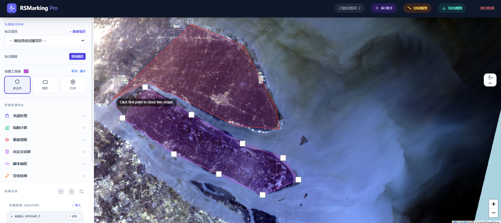
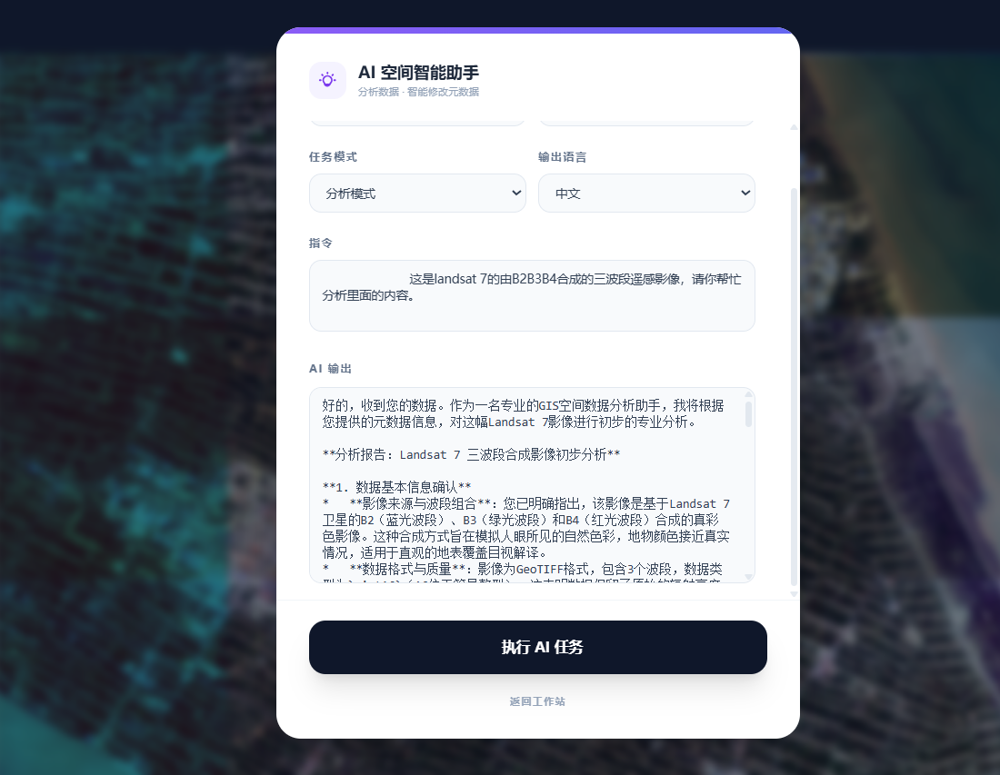
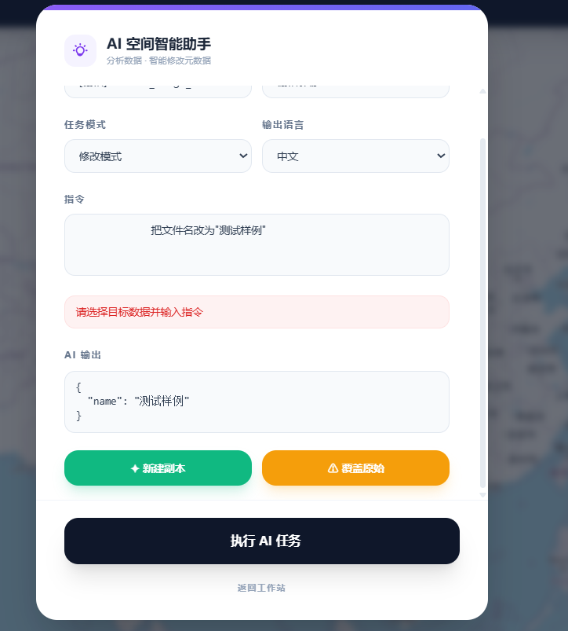

# RSMarking

RSMarking is a remote-sensing annotation and raster analysis workspace. It combines a Leaflet/Cesium browser map, FastAPI microservices, PostGIS-backed vector storage, GDAL/rasterio processing, a permission-aware AI agent, and an optional Celery worker layer for longer-running jobs.

The repository is currently most useful as a local development stack for GeoTIFF upload, raster metadata management, on-the-fly map tiles, vector annotation, raster/vector analysis tools, AI-assisted project operations, and Docker-isolated custom Python scripts.

> Documentation status: updated against the repository on 2026-07-28. The PowerShell launcher, service entry points, `.env.example`, and tests remain the operational sources of truth.

## Features

- Browser map client with synchronized Leaflet and Cesium 2D/3D viewing, including antimeridian, polar, and repeated-world geometry normalization.
- Chinese, English, Japanese, and Spanish interface and AI response languages.
- GeoTIFF metadata ingestion with raw and COG storage directories.
- On-the-fly raster tile rendering with bounded requests, L1/L2 caching, concurrent-miss coalescing, HTTP ETags, and optional Cython acceleration.
- Vector projects, layers, features, attribute fields, shapefile import, and PostGIS spatial indexes.
- Vector tile service using PostGIS `ST_AsMVT`.
- Raster algorithms for NDVI, NDWI, NDBI, MNDWI, band extraction, band merge, raster calculator expressions, DEM analysis, Fourier/wavelet/PCA transforms, texture feature extraction, time-series analysis, rasterization, clipping, and change detection.
- Extraction algorithms for vegetation, water, buildings, and clouds.
- AI gateway built around LiteLLM with analyze/modify modes, a callable tool registry, conversation memory, safe attachments, and four per-request permission tiers.
- Docker-isolated Python script executor with validated raster/vector inputs, bounded logs, resource limits, and restricted host-path access.
- Optional Celery worker cluster for offline preprocessing, index calculation, and GeoJSON export jobs.

## Frontend Tool Placement Standards

RSMarking separates raster workflows between the main **Imagery Processing Center** and each raster row's hidden **RASTER FUNCTIONS** menu.

Use **Imagery Processing Center** for reusable processing workflows that can be started without first opening a specific raster row. A tool belongs here when it creates a derived raster/vector product, changes raster geometry or radiometry, combines multiple inputs, runs a classification or extraction algorithm, or opens a full workflow modal with its own source-raster selector and parameters.

Current Processing Center groups:

| Group | Tools |
|---|---|
| DEM Analysis | Elevation, slope, aspect, hillshade/shading, curvature, topographic relief, topographic humidity index, flow direction, flow accumulation, watershed delineation |
| Transform Analysis | Fourier analysis, wavelet analysis, PCA |
| Texture Features | GLCM, local statistics window, Gabor filtering, LBP |
| Time-Series Analysis | Monthly compositing, annual compositing, maximum value compositing, median compositing, moving window smoothing, Savitzky-Golay filtering, trend analysis, seasonality analysis, phenological parameter extraction |
| Band Processing | Band merge, band extraction, resampling |
| Preprocessing | Radiometric calibration, geometric correction |
| Index Calculation | NDVI, NDWI, NDBI, MNDWI |
| Feature Extraction | Vegetation, water, building, cloud extraction |
| Classification | Supervised classification, unsupervised classification, deep learning segmentation |
| Raster Calculator | General raster calculator |
| Script Programming | Python script editor |
| Change Detection | Band difference, ratio, and index-difference workflows |
| Format Conversion | Vector-to-raster and raster-to-vector conversion |

Use **RASTER FUNCTIONS** for row-context actions on the exact raster item the user opened. A tool belongs here when it inspects, manages, or edits metadata for that one raster and does not represent a general algorithm workflow. These actions may use the raster row as their only context and should remain quick, local, and non-discoverability-critical.

Current RASTER FUNCTIONS actions:

| Action | Reason |
|---|---|
| Spectral Profile | Starts map inspection for the selected raster |
| Raster Statistics | Opens descriptive statistics for the selected raster |
| Attribute Table | Manages metadata/fields attached to the selected raster |
| Remove Raster | Deletes the selected raster item |

When adding a new tool, place it in **Imagery Processing Center** by default if it produces a new analytical output or needs a parameter form. Place it in **RASTER FUNCTIONS** only when the action is fundamentally tied to the opened raster row and is primarily inspect/manage/delete behavior. If a Processing Center workflow benefits from a selected raster shortcut, pass that raster into the modal as a preselected source rather than duplicating the workflow in RASTER FUNCTIONS.

## Architecture

```text
client/index.html
  |
  | HTTP
  v
+----------------------+      +-----------------------+
| annotation_service   |      | data_service          |
| :8001                |      | :8002                 |
| projects/layers/     |      | uploads/metadata/     |
| features/fields      |      | raster algorithms     |
+----------+-----------+      +-----------+-----------+
           |                              |
           |                              |
           v                              v
+----------------------+      +-----------------------+
| vtile_service        |      | tile_service          |
| :8003                |      | :8005                 |
| PostGIS MVT tiles    |      | raster XYZ PNG tiles  |
+----------------------+      +-----------------------+

+----------------------+      +-----------------------+
| executor_service     |      | ai_gateway            |
| :8004                |      | :8006                 |
| Docker sandbox       |      | LiteLLM + policy gate |
+----------------------+      +-----------------------+

PostgreSQL/PostGIS, Redis, and RabbitMQ are provided by infrastructure/docker/docker-compose.yml.
The Compose file provides infrastructure; the launcher starts the application services on the host.
worker_cluster is optional and consumes RabbitMQ tasks while reporting status through Redis.
```

## Repository Map

```text
client/                         Static browser client
  index.html                    Main app shell
  packages/app/src/             App modules, API adapters, state, i18n
  packages/core/src/map.js      Leaflet/Cesium map engine
  packages/core/src/geo/geometryRender.js
                                Shared 2D/3D geometry normalization
  packages/ui/src/              Modal and sidebar templates/components

services/
  annotation_service/           Vector projects, layers, features, fields
  data_service/                 Raster metadata, uploads, algorithms, bridges
  tile_service/                 Raster tile engine and Cython extensions
  vtile_service/                PostGIS vector tile endpoint
  executor_service/             Docker sandbox for custom Python scripts
  ai_gateway/                   AI analyze/modify gateway and tool registry

functions/
  implement/                    Core raster, vector, index, extraction algorithms
  common/                       Shared helpers such as Snowflake-style IDs

worker_cluster/                 Optional Celery worker layer
infrastructure/docker/          PostgreSQL/PostGIS, RabbitMQ, Redis compose file
infrastructure/*_migrations/    Alembic migrations for raster and vector DBs
storage/raw/                    Uploaded/original rasters and script outputs
storage/cog/                    Cloud-optimized GeoTIFF outputs
tests/                          Pytest, Vitest, and benchmark tests
resources/                      README screenshots and benchmark images
```

## Services

| Service | Port | Entry point | Main responsibility |
|---|---:|---|---|
| Annotation service | 8001 | `services.annotation_service.main:app` | Projects, layers, vector features, fields, shapefile import |
| Data service | 8002 | `services.data_service.main:app` | Raster metadata, uploads, spectral indices, extraction, clipping, scripts |
| Vector tile service | 8003 | `services.vtile_service.main:app` | MVT tiles from PostGIS |
| Executor service | 8004 | `services.executor_service.main:app` | Docker-isolated Python script execution |
| Tile service | 8005 | `services.tile_service.main:app` | Cached RasterIO XYZ PNG rendering and HTTP revalidation |
| AI gateway | 8006 | `services.ai_gateway.main:app` | AI analyze/modify requests, agent policy enforcement, and callable tools |

## Rendering Architecture

### Browser 2D/3D rendering

Source GeoJSON remains unchanged in application state. Before display, the shared geometry pipeline unwraps longitudes, splits antimeridian and polar crossings, and generates renderer-specific copies for Leaflet and Cesium. This prevents a 2D/3D switch from feeding one renderer's clipped coordinates back into the other and supports features that cross the dateline or wrap around the globe more than once.

Raster layers use the tile service below in both modes. The map engine reconciles renderer state when switching modes; it does not change raster pixels or source metadata.

### Raster tile request path

```text
GET /tile/{index_id}/{z}/{x}/{y}.png
  -> validate XYZ and requested bands
  -> resolve the current raster path/version
  -> run blocking cache, RasterIO, and PNG work in a worker thread
  -> coalesce concurrent misses for the same tile
  -> L1 memory cache / L2 disk cache
  -> CRS-aware RasterIO masked window read and resampling
  -> stretch + RGBA render + PNG encode
  -> ETag and Cache-Control response
```

The source file modification time and size are part of the internal cache key, so a replaced raster does not reuse an old rendered tile. Browser/proxy revalidation uses a content-derived ETag. Missing files return a transparent tile with `Cache-Control: no-store`.

The tile service loads compiled Cython rendering helpers when the local extension is available and otherwise uses the NumPy implementation. `GET :8005/health` reports the active renderer instead of assuming acceleration.

To rebuild the optional extension for the active Python environment:

```powershell
cd services/tile_service
python setup.py build_ext --inplace
cd ../..
```

Important tile settings (all optional):

| Setting | Default | Purpose |
|---|---:|---|
| `TILE_MAX_BANDS` | `4` | Bounds client-controlled RasterIO and render work |
| `TILE_MAX_ZOOM` | `24` | Rejects invalid or unreasonable XYZ requests |
| `TILE_RASTER_OPEN_MODE` | `per_request` | Uses isolated RasterIO handles; `thread_local` is an opt-in reuse mode |
| `TILE_RESAMPLING_MODE` | `quality` | Selects the configured resampling policy |
| `TILE_ALPHA_MODE` | `auto` | Chooses data/mask alpha behavior |
| `TILE_PNG_COMPRESS_LEVEL` | `1` | Balances PNG CPU cost and response size |
| `TILE_HTTP_CACHE_MAX_AGE_SECONDS` | `60` | Browser/proxy freshness lifetime |
| `TILE_HTTP_CACHE_STALE_WHILE_REVALIDATE_SECONDS` | `300` | Allows stale tiles during background revalidation |
| `TILE_PROFILE` | `false` | Logs per-stage tile timing for diagnosis |

See `.env.example` for path-cache and engine-cache controls. Keep `per_request` for general development; use `thread_local` only after representative load testing because RasterIO dataset handles are thread-affine.

## Prerequisites

- Docker Desktop or Docker Engine with Compose.
- Conda or Mamba.
- Python 3.12. The checked-in `environment.yml` creates a Python 3.12 environment named `rsmarking`.
- A browser. The frontend is currently a static app, so there is no `npm run dev` workflow in this revision.
- Optional: Node.js if you want to run the Vitest frontend unit tests.

## Quick Start

From the repository root:

### One-click Windows launch

Double-click `rsmarking.exe` when it has been built, double-click
`launch_rsmarking.bat`, or run:

```powershell
.\launch_rsmarking.ps1
```

The launcher starts Docker Desktop when it can find it, runs `docker compose up -d`,
prepares databases/extensions, runs migrations, writes the frontend runtime
configuration, starts the Celery worker, starts all six FastAPI services,
checks that the frontend is reachable, writes logs to `logs/launch`, and opens:

```text
http://localhost:8002/client/index.html
```

Stop the launched processes with:

```powershell
.\stop_rsmarking.ps1
```

If the executable wrapper has been rebuilt, you can also stop without an
interactive pause by double-clicking `rsmarking-stop.exe` or running:

```powershell
.\rsmarking.exe --stop
```

Useful options:

```powershell
.\launch_rsmarking.ps1 -Reload
.\launch_rsmarking.ps1 -AllowInlineFallback
.\launch_rsmarking.ps1 -NoBrowser
.\launch_rsmarking.ps1 -RequireExecutorImage
.\stop_rsmarking.ps1 -StopDocker
```

The executable is intentionally a thin wrapper over the PowerShell scripts, so
the PowerShell launch/stop scripts remain the source of truth. It forwards
startup arguments to `launch_rsmarking.ps1`, for example:

Keep `rsmarking.exe` in the repository root. At runtime it enters that folder
and starts `.\launch_rsmarking.bat` with relative paths.

```powershell
.\rsmarking.exe -NoBrowser -AllowInlineFallback
```

Build or rebuild the executable from the repository root with:

```powershell
.\tools\build_rsmarking_exe.ps1
```

The build script uses the `rsmarking` Conda environment when available and
installs PyInstaller into that environment if it is missing. The outputs are
written to `.\rsmarking.exe` and `.\rsmarking-stop.exe`.

The script uses the active `python` when it has the required packages; if not,
it tries `conda run -n rsmarking python`.

The executor sandbox image is built automatically when missing. If Docker Hub
or the base image pull is unavailable, the launcher warns and continues so the
frontend and normal backend workflows still start; use `-RequireExecutorImage`
when custom script execution must be available before startup is considered
successful.

Custom scripts receive selected raster inputs as `input_0`, `input_1`, and
stable `raster_<index_id>` aliases. A map-selected vector feature is copied
into the isolated container as real GeoJSON and exposed as `feature_0`,
`features`, and `feature_by_id`; helpers include `feature_geometry()`,
`feature_shape()`, and `read_geojson()`. Scripts that only inspect or calculate
vector data may finish without creating a raster, in which case their bounded
execution log is shown in the script editor. Raster-producing scripts should
write `OUTPUT_FILE`.

Host raster paths are accepted only from the repository `storage` directory by
default. Deployments with additional managed data roots can set
`SANDBOX_ALLOWED_INPUT_ROOTS` using the platform path separator.

### Manual launch

From the repository root:

```powershell
conda env create -f environment.yml
conda activate rsmarking
```

Start infrastructure:

```powershell
cd infrastructure/docker
docker compose up -d
cd ../..
```

This Compose stack starts PostgreSQL/PostGIS, RabbitMQ, and Redis only. Start the six FastAPI application services separately with the commands below, or use the one-click launcher.

The compose file creates the `rsmarking` database. The annotation and vector tile services default to a separate `vector_db` database, so create it once:

```powershell
docker exec rsmarking-postgres createdb -U rs_admin vector_db
docker exec rsmarking-postgres psql -U rs_admin -d rsmarking -c "CREATE EXTENSION IF NOT EXISTS postgis;"
docker exec rsmarking-postgres psql -U rs_admin -d vector_db -c "CREATE EXTENSION IF NOT EXISTS postgis;"
```

If `vector_db` already exists, the first command can fail harmlessly.

Run database migrations:

```powershell
cd infrastructure/db_migrations
alembic upgrade head
cd ../annot_migrations
alembic upgrade head
cd ../..
```

Build the executor sandbox image if you plan to use custom scripts:

```powershell
docker build -t rs-worker-python:latest -f services/executor_service/runtime/python_base.Dockerfile services/executor_service/runtime
```

Start services in separate terminals from the repository root:

```powershell
python -m uvicorn services.annotation_service.main:app --host 0.0.0.0 --port 8001 --reload
python -m uvicorn services.data_service.main:app --host 0.0.0.0 --port 8002 --reload
python -m uvicorn services.vtile_service.main:app --host 0.0.0.0 --port 8003 --reload
python -m uvicorn services.executor_service.main:app --host 0.0.0.0 --port 8004 --reload
python -m uvicorn services.tile_service.main:app --host 0.0.0.0 --port 8005 --reload
python -m uvicorn services.ai_gateway.main:app --host 0.0.0.0 --port 8006 --reload
```

Open the client through the data service static mount:

```text
http://localhost:8002/client/index.html
```

You can also serve the repository root with any static file server and open `/client/index.html`.

## AI Gateway Configuration

The AI gateway loads `.env` from the repository root and calls LiteLLM. A minimal DeepSeek-style configuration looks like this:

```env
AI_MODEL=deepseek/deepseek-chat
DEEPSEEK_API_KEY=sk-...
```

Use any LiteLLM-supported provider by changing `AI_MODEL` and setting the provider-specific API key expected by LiteLLM. `AI_NAME` and `AI_MODEL_NAME` remain compatibility fallbacks, but `AI_MODEL` is the preferred setting.

The agent can create persistent downloadable documents, SVG images, and CSV/XLSX/JSON tables. To enable provider-backed raster image generation as well, configure a LiteLLM-compatible image model separately:

```env
AI_IMAGE_MODEL=openai/gpt-image-1
OPENAI_API_KEY=sk-...
```

Generated files are stored under `storage/ai_artifacts` by default; override that location with `AI_ARTIFACT_DIR`.

Core endpoints:

| Method | Path | Purpose |
|---|---|---|
| `POST` | `/ai/process` | Analyze or modify a raster/vector target |
| `GET` | `/ai/functions?format=openai` | Return callable tools in OpenAI tool schema format |
| `GET` | `/ai/functions?format=catalog` | Return a readable function catalog |
| `POST` | `/ai/functions/invoke` | Invoke a registered algorithm function directly |
| `POST` | `/ai/agent` | Run the permission-aware tool-using agent |
| `GET/POST/DELETE` | `/ai/conversations` | List, save, or clear archived agent conversations |
| `GET/DELETE` | `/ai/conversations/{archive_id}` | Read or delete one archived conversation |
| `POST` | `/ai/conversations/{archive_id}/restore` | Restore an archive into an agent session |
| `GET` | `/ai/artifacts/{artifact_id}` | Preview an AI-generated image artifact |
| `GET` | `/ai/artifacts/{artifact_id}/download` | Export an AI-generated artifact |

`/ai/process` accepts `target_id`, `data_type` (`raster` or `vector`), `mode` (`analyze` or `modify`), `language`, `user_prompt`, optional `overwrite`, optional `session_id`, and optional `map_context`.

In modify mode, the Pydantic layer only accepts currently modifiable fields such as raster/vector `name`; read-only spatial statistics and metadata are not written back from model output.

Registered AI-callable functions include downloadable document/table generation, optional AI image generation, raster discovery/metadata/statistics/spectrum and field management, processing-status lookup, spectral indices, raster calculator, DEM analysis, Fourier/wavelet/PCA transforms, texture feature extraction, time-series analysis, vegetation/water/building/cloud extraction, raster/vector clipping, and change detection.

`/ai/agent` accepts `user_prompt`, `language`, optional `target_id` plus `data_type`, optional `map_context`, optional `session_id`, optional `tool_names`, bounded `attachments`, and step/tool-call budgets. It supports conversational sessions (`history_limit`, `reset_session`) and compact saved-conversation memory (`include_archive_memory`, `archive_memory_limit`). By default it injects a bounded overview of current rasters, vector projects, and layers; use `include_workspace_context=false` or tune `workspace_limit` when a smaller prompt is needed. The response includes a final `answer`, `session_id`, `history_length`, `used_tools`, a compact `steps` trace, and safe preview/export URLs for generated artifacts.

Agent permissions are a per-request capability ceiling:

| `permission_level` | Allowed behavior |
|---|---|
| `read_only` | Inspect and explain project data; no execution or mutation |
| `safe` | Inspect, run isolated processing, and create new outputs; no update/delete |
| `standard` | Task-scoped execution and creation; update/delete require explicit current-turn authorization |
| `full_control` | Autonomously operate on project data for an actionable task, while respecting explicit exclusions |

Every tier retains hard boundaries: the agent cannot modify repository source code, sandbox policy, host files, or service controls. Tool authorization is derived from the current user task, not from model reasoning, conversation history, workspace metadata, attachments, or tool output. Those context sources are marked as untrusted data, which prevents embedded prompt text from granting itself permission.

## API Quick Reference

Data service (`:8002`):

- `POST /upload`
- `GET /list`
- `DELETE /raster/{raster_id}`
- `POST /merge-bands`
- `POST /extract-bands`
- `POST /resample-raster`
- `POST /radiometric-calibration`, `/geometric-correction`
- `POST /calculate-ndvi`, `/calculate-ndwi`, `/calculate-ndbi`, `/calculate-mndwi`
- `POST /extract-vegetation`, `/extract-water`, `/extract-buildings`, `/extract-clouds`
- `POST /dem-analysis`
- `POST /raster-transform-analysis`
- `POST /texture-feature-analysis`
- `POST /time-series-analysis`
- `POST /classify-supervised`, `/classify-unsupervised`, `/segment-deep-learning`
- `POST /clip-raster-by-vector`
- `POST /raster-calculator`
- `GET /tasks/{task_id}/status`
- `GET /jobs/{job_id}`
- `GET /raster/{raster_id}/statistics`
- `GET /raster/{raster_id}/spectrum`
- `POST /execute-script`
- `POST /change/band-diff`, `/change/band-ratio`, `/change/index-diff`
- `POST /rasterize/layer-to-raster`
- `POST /rasterize/raster-to-vector`

Annotation service (`:8001`):

- `POST /projects`, `GET /projects`, `DELETE /projects`
- `POST /projects/{project_id}/layers`, `GET /projects/{project_id}/layers`
- `POST /layers/{layer_id}/features`, `GET /layers/{layer_id}/features`
- `GET/PATCH/DELETE /features/{feature_id}`
- `POST /layers/{layer_id}/bulk`
- `GET/POST/PATCH/DELETE /layers/{layer_id}/fields`
- `POST /spatial/clip-vector-by-raster`

Tile services:

- `GET :8005/tile/{index_id}/{z}/{x}/{y}.png?bands=1,2,3`
- `GET :8003/tiles/{layer_id}/{z}/{x}/{y}.pbf`

Executor service (`:8004`):

- `POST /execute`
- `GET /health`

## Optional Worker Cluster

`worker_cluster` contains Celery tasks for offline raster/vector jobs. Core raster product routes in `data_service` submit cluster jobs when `RS_PROCESSING_BACKEND` is `cluster`, `celery`, `worker`, or `async`.

Start a worker after RabbitMQ and Redis are running:

```powershell
celery -A worker_cluster.app.celery_app worker --loglevel=info --pool=solo --concurrency=1 -Q preprocess,index,export
```

`RS_CLUSTER_FALLBACK=1` keeps local development working by falling back to inline processing if dispatch is unavailable or no ready worker is consuming the target queue. Set `RS_PROCESSING_BACKEND=inline` to force inline execution, or `RS_CLUSTER_FALLBACK=0` to fail fast when the cluster is unavailable.

See `worker_cluster/README.md` for task names, producer examples, Redis status tracking, and cluster integration details.

## Testing

Python unit tests:

```powershell
python -m pytest tests/unit/functions
python -m pytest tests/unit/services
python -m pytest tests/unit/services/tile_rendering -m "not benchmark"
```

Service communication tests:

```powershell
python -m pytest tests/integration
```

The bridge tests mock cross-service HTTP calls. To probe a running stack on the six FastAPI service ports, enable the opt-in live checks:

```powershell
$env:RS_RUN_PORT_TESTS = "1"
python -m pytest tests/integration/test_port_communication.py
```

Override a live port target with `RS_PORT_TEST_ANNOTATION_URL`, `RS_PORT_TEST_DATA_URL`, `RS_PORT_TEST_VTILE_URL`, `RS_PORT_TEST_EXECUTOR_URL`, `RS_PORT_TEST_TILE_URL`, or `RS_PORT_TEST_AI_URL`.

Benchmarks are opt-in:

```powershell
$env:RS_RUN_BENCHMARKS = "1"
python -m pytest tests/unit/services/tile_rendering/benchmark -m benchmark
```

Frontend unit tests:

```powershell
npm install
npm test
```

## Screenshots

### Raster Rendering



### Vector Annotation



### AI Analyze Mode



### AI Modify Mode



### Map Export


## Current Caveats

- Some older comments and auxiliary docs in the repository are mojibaked; edited text files should be kept as UTF-8.
- The frontend does not currently ship a package-managed dev server workflow; use the data-service static mount or another static server while developing the app.
- The infrastructure Compose file does not containerize the six application services.
- The helper start scripts under `services/` are not the most reliable source of truth. Prefer the explicit `uvicorn` commands above while developing.
- The Cython tile renderer is optional. Builds without the extension use the tested NumPy fallback and may have lower throughput.
- `TILE_RASTER_OPEN_MODE=thread_local` trades fewer dataset opens for more lifecycle complexity; benchmark it with the deployment's actual server/thread model before enabling it.
- Very large vector layers are still transferred as GeoJSON in several annotation workflows; the PostGIS MVT service is available, but not every browsing path has migrated to it.
- `worker_cluster` is optional; processing can still run inline according to `RS_PROCESSING_BACKEND` and fallback settings.
- Do not commit real `.env` API keys.

## License

MIT. See `LICENSE`.
